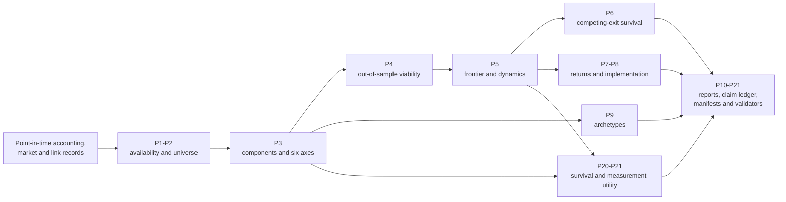

# Corporate Niche Dynamics

**An auditable research framework for mapping competitive crowding and strategic change in corporate business-model space.**

[](https://github.com/JoshGutierrez56/corporate-niche-dynamics/actions/workflows/ci.yml)
[](https://www.python.org/)
[](#research-verdict)

Corporate Niche Dynamics represents a firm as a point in a six-dimensional
business-model space, tracks how that point moves, and tests whether the
resulting geometry measures anything useful. The project was designed around
point-in-time information, temporal validation, preregistered decision gates,
and explicit preservation of negative results.

The short version is:

> The project supports a **synthetic competitive-crowding measurement**. It
> does **not** support an investable return strategy, a general survival model,
> a stable firm taxonomy, or any real-company claim.

The product-facing name used in the research is **Corporate Niche Monitor**.
The historical Python package remains `hypercube`, and the distribution name
remains `business-niche-hypercube`, so the frozen research record stays
traceable.

## Research verdict

The final frozen status is **`RESEARCH_BENCHMARK_ONLY`**.

| Use case | Status | Frozen result | Interpretation |
|---|---|---:|---|
| Competitive-crowding measurement | **Supported in the synthetic benchmark** | Pooled Spearman `0.3215`; scenario range `0.2939`-`0.3384`; coverage `93.33%` | The representation recovers relative local density in latent business-model space. |
| Strategic-drift ranking | **Exploratory** | Precision `0.2421` vs. `0.25` gate; direction accuracy `85.85%` | Useful for ranking and analyst triage, but it missed the frozen alert-precision gate. |
| Structural-peer retrieval | **Exploratory** | Recall@20 `0.04838`; `4.23x` random | Better than random, but below the `0.05` recall and `5x` lift gates. |
| General survival prediction | **Rejected** | Mean incremental AUC lift `-0.00273` | The axes did not add robust utility beyond profitability/distress controls. |
| Investable return strategy | **Rejected** | Net annualized return `-5.16%`; Sharpe `-0.84` | The frozen portfolio failed after conservative costs. |
| Stable economic archetypes | **Rejected** | `94.68%`-`96.50%` noise/unassigned | The clustering layer was not stable or economically usable. |

These are synthetic research results. No real-company dataset, causal study,
live portfolio, or investability validation has been run.

## What the system measures

Each eligible firm observation receives two versions of six composite axes:

1. **Demand strength and pricing power**
2. **Competitive defensibility**
3. **Innovation intensity**
4. **Go-to-market efficiency**
5. **Unit economics and profit quality**
6. **Scalability and capital efficiency**

The **relative** representation compares a firm with contemporaneously
available peers. The **anchored** representation compares it with an
expanding historical reference distribution that ends before the observation
year. Higher values consistently mean more viable or defensible.

The system then derives:

- local crowding in six-dimensional space;
- viability level, frontier margin, velocity, and acceleration;
- migration or strategic-drift scores;
- candidate structural peers;
- time-varying survival features;
- gross and cost-aware portfolio diagnostics; and
- signed manifests and independent validation receipts.

The `3^6 = 729` cell grid is an interpretability layer. Continuous geometry and
models are primary.

## What this repository is—and is not

### It is

- a reproducible synthetic methods benchmark;
- a reference implementation for point-in-time financial feature engineering;
- an example of expanding-window, horizon-purged validation;
- a record of confirmatory, exploratory, and rejected hypotheses;
- a candidate measurement architecture for future real-data research; and
- a compact publication of code, protocols, figures, result tables, and
  provenance receipts.

### It is not

- financial advice or a trading system;
- a source of buy/sell labels;
- a validated predictor of firm failure;
- a causal model of competition or strategy;
- a production comparable-company engine;
- a stable corporate taxonomy; or
- evidence about real firms.

## Architecture



The core design rule is that every observation must be constructible using
information available at that time. Availability dates, dated security links,
rolling transforms, peer references, model fitting, calibration, and
hyperparameter selection are all constrained accordingly.

## Research phases

| Phase | Purpose |
|---|---|
| P0-P3 | Scaffold, deterministic synthetic inputs, point-in-time panel, and six-axis construction |
| P4-P6 | Fixed-horizon viability, frontier dynamics, and competing-exit survival |
| P7-P10 | Return tests, costs/capacity, clustering, figures, and reproducibility closeout |
| P11E-P15E | Power diagnostics, proxy redesign, eligibility audit, and locked calibration |
| P16E-P19E | Isolated canaries, cost/archetype decisions, and final claim ledger |
| P20E | Incremental survival-utility audit |
| P21E | Measurement-utility audit and final product positioning |

The `E` and `F` suffixes identify explicitly versioned extensions or corrected
protocols. They are retained rather than overwritten so the decision history
is inspectable.

## Repository map

```text
.
|-- hypercube/                 Core research library
|-- scripts/                   Phase builders, runners, and independent validators
|-- tests/                     Unit, contract, and pipeline-scaffold tests
|-- configs/                   Frozen base, synthetic, real-data, and scenario settings
|-- docs/                      Protocols, preregistrations, policies, and results
|-- artifacts/
|   |-- manifests/             Signed build and validation receipts
|   |-- tables/                Compact frozen result tables
|   |-- logs/                  Test and phase logs
|   `-- checkpoints/           Frozen generated phase configurations
|-- figures/                   Publication figures and registry
|-- report.md                  P10 integrated research report
|-- CITATION.cff               Citation metadata
|-- CONTRIBUTING.md            Contribution and evidence rules
`-- pyproject.toml             Package and dependency definition
```

Generated raw/intermediate/processed Parquet data, fitted model objects, and
large phase-event outputs are intentionally excluded from Git. They are
deterministic or reproducible from the included code and configs, and would
otherwise add roughly 1.1 GB of duplicate binary state. Compact frozen
evidence is retained in `artifacts/manifests`, `artifacts/tables`,
`artifacts/logs`, and `figures`.

## Quick start

### Requirements

- Python 3.11 or newer
- [`uv`](https://docs.astral.sh/uv/) (recommended)
- Enough local disk space for generated synthetic Parquet outputs

Clone and install:

```bash
git clone https://github.com/JoshGutierrez56/corporate-niche-dynamics.git
cd corporate-niche-dynamics
uv sync --extra dev
```

Run the fast verification suite:

```bash
uv run pytest -q
```

The tests exercise the axis contracts, point-in-time transformations,
synthetic recovery logic, models, portfolio/cost logic, clustering,
measurement utilities, and pipeline scaffolding. They do not regenerate the
full research corpus. The publication build passes **89 tests**.

## Reproduce the synthetic P1-P10 pipeline

The main orchestrator is ordered, resumable, offline, and independently
validates completed bundles before reusing them:

```bash
uv run python scripts/run_full_pipeline.py \
  --config configs/synthetic.yaml
```

On Windows PowerShell, the same command can be entered on one line:

```powershell
uv run python scripts/run_full_pipeline.py --config configs/synthetic.yaml
```

The pipeline:

1. generates the three deterministic synthetic raw scenarios;
2. builds the point-in-time firm-month panels;
3. constructs relative and historically anchored axes;
4. fits and validates expanding-window viability models;
5. computes frontier dynamics and migration features;
6. evaluates survival, returns, costs, capacity, and clustering;
7. rebuilds the integrated figures and report; and
8. runs the test suite and writes a final receipt.

The three synthetic scenarios are:

- `null_alpha`
- `migration_alpha`
- `regime_shift`

To generate raw inputs separately:

```bash
uv run python scripts/make_synthetic.py \
  --config configs/synthetic.yaml \
  --all-scenarios
```

After P1-P10, reproduce the final utility audits:

```bash
uv run python scripts/run_p20e_survival_utility.py
uv run python scripts/validate_p20e_survival_utility.py
uv run python scripts/run_p21e_measurement_utility.py
uv run python scripts/validate_p21e_measurement_utility.py
```

The later isolated canary phases have their own frozen preregistrations,
runners, and validators under `docs/` and `scripts/`. They are not folded into
the main orchestrator because isolation from the original analytical root was
part of their design.

## How to read the evidence

Start with these files:

1. [`docs/product_positioning.md`](docs/product_positioning.md) — what the
   system may and may not be called.
2. [`docs/p21e_measurement_utility_results.md`](docs/p21e_measurement_utility_results.md)
   — the final measurement verdict.
3. [`docs/p20e_survival_utility_results.md`](docs/p20e_survival_utility_results.md)
   — why general survival utility was rejected.
4. [`docs/p19e_final_closeout_results.md`](docs/p19e_final_closeout_results.md)
   — the alpha, cost, archetype, and closeout verdicts.
5. [`report.md`](report.md) — the integrated P1-P10 report.
6. [`docs/point_in_time_policy.md`](docs/point_in_time_policy.md) — the
   governing anti-leakage rules.
7. [`docs/research_spec.md`](docs/research_spec.md) — the original research
   questions and evidence rules.

For machine-readable evidence:

- `artifacts/tables/p19e_claim_ledger.csv` is the final claim ledger.
- `artifacts/tables/p21e_use_case_matrix.csv` records the P21 gate decisions.
- `artifacts/manifests/*_validation.json` contains independent validation
  status and error lists.
- `artifacts/manifests/p21e_manifest.json` records file sizes and SHA-256
  hashes for the final measurement phase.
- `artifacts/tables/p10_figure_registry.csv` maps figures to their data and
  hashes.

Historical manifests describe the exact frozen analytical runs. The
publication repository also carries a separate
`artifacts/manifests/public_repository_manifest.json` so the exported,
portable source tree can be audited independently of those historical
receipts. Machine-specific path fields in copied logs and receipts are
normalized to `${PROJECT_ROOT}` and `${HYPERCUBE_CANARY_ROOT}` for
publication; the untouched analytical root remains the authority for
byte-identical historical receipt validation.

## Headline findings in context

### Competitive crowding: supported

The anchored-axis local-density measure recovered latent density with pooled
Spearman correlation `0.3215`. All three scenarios cleared the frozen
scenario-level threshold, and complete-case coverage was `93.33%`.

This supports statements such as:

- “Firm A occupies a relatively crowded region of the synthetic
  business-model space.”
- “Several firms are converging on similar measured operating positions.”
- “Crowding changed materially between two point-in-time observations.”

It does not support statements such as:

- “Crowding causes lower returns.”
- “This firm will fail.”
- “This is a buy or sell signal.”

### Strategic drift: useful direction, failed alert gate

The locked drift score achieved `85.85%` directional accuracy among alerts and
improved precision over the existing benchmark by `0.0557`. Its overall
precision was `0.2421`, narrowly below the preregistered `0.25` requirement.

The defensible use is exploratory ranking for analyst review—not a validated
extreme-event alert.

### Structural peers: better than random, not validated

The peer map reached Recall@20 of `0.04838`, compared with analytical random
recall of `0.01145`. That is `4.23x` random, but it missed both the `0.05`
pooled-recall gate and the `5x` lift gate.

It may supplement industry screens in future research. It should not replace
comparable-company judgment.

### Survival: narrow stress signal, no general utility

Adding all twelve relative and anchored axes to conventional financial
controls produced mean AUC lift of `-0.002732` over 24 outer folds. The only
encouraging pattern occurred in the regime-shift scenario: seven of eight
folds improved, with five-year mean lift of `+0.01721`.

That stress-regime pattern is exploratory. It did not generalize across normal
synthetic environments.

### Returns and archetypes: rejected

The redesigned migration proxy recovered a deliberately amplified synthetic
effect, but the frozen implementation lost money after costs. The archetype
layer assigned roughly `95%` of observations to noise and had effectively zero
stability. Neither result was promoted.

Preserving these failures is part of the project’s design, not an omission.

## Point-in-time and leakage controls

The implementation enforces:

- accounting availability based on SEC timestamps, earnings-announcement
  dates, or a conservative fallback delay;
- the first eligible month-end strictly after public availability;
- dated and allowlisted security-company links;
- explicit staleness, duplicate, revision, and delisting rules;
- trailing or expanding transforms only;
- contemporaneous peer references;
- training-only scaling, calibration, clustering, and hyperparameter
  selection;
- expanding-window outer tests with horizon purges;
- no future-filled missing values;
- no same-period target return at signal formation; and
- outcome-blind construction of the axes.

Synthetic truth is opened only by designated independent recovery audits.
Feature builders and predictive/portfolio stages cannot use it.

See [`docs/point_in_time_policy.md`](docs/point_in_time_policy.md) for the full
contract.

## Real-data mode

The repository includes `configs/real.yaml` and a detailed schema in
[`docs/data_dictionary.md`](docs/data_dictionary.md), but no licensed WRDS,
Compustat, CRSP, SEC, or other real-company data.

Real-data mode:

- does not enable network access;
- does not download from WRDS;
- expects local, licensed Parquet inputs;
- must freeze timestamp, universe, link, and missingness rules before use; and
- must begin as a measurement-only pilot before any outcome test.

The recommended next study is:

1. freeze a point-in-time filing universe and axis specification;
2. test coordinate stability, coverage, and perturbation sensitivity without
   opening outcomes;
3. test adjacent-filing crowding stability;
4. conduct blinded analyst review of crowded and sparse cases; and
5. only after those gates pass, preregister a separate event or outcome study.

## Reproducibility and provenance

The project uses:

- pinned dependencies in `uv.lock` and `requirements.txt`;
- deterministic synthetic seeds;
- atomic artifact writes;
- per-phase resolved configs;
- SHA-256 file records;
- independent builders and validators;
- frozen preregistration documents;
- row-count waterfalls and coverage diagnostics; and
- signed positive, null, and negative findings.

The original local analytical project and this public repository are
deliberately distinguished:

- **Analytical manifests** attest to historical frozen phase outputs.
- **The publication manifest** attests to the portable files in this Git
  revision.

That distinction prevents README, CI, or portability edits from being
misrepresented as part of an earlier signed analytical run.

## Limitations

- All current validation is synthetic.
- The latent data-generating process is necessarily simpler than real firms.
- Accounting proxies are imperfect representations of strategy and
  competitive position.
- Point-in-time correctness reduces, but cannot eliminate, real-source
  revision and identifier risks.
- Local density can be measured without proving an economic consequence.
- Narrowly missed gates remain failures under the frozen protocol.
- A public codebase does not grant access to the licensed data required for a
  real-company study.

## Contributing

Read [`CONTRIBUTING.md`](CONTRIBUTING.md) before opening a pull request.
Changes that affect a frozen claim should be introduced as a new protocol and
phase, not silently substituted into an existing result. Please preserve
negative findings and add tests for every change to point-in-time behavior.

## Citation

Citation metadata is available in [`CITATION.cff`](CITATION.cff). A plain-text
citation is:

> Gutierrez, Josh (2026). *Corporate Niche Dynamics: An Auditable Research
> Framework for Competitive Crowding and Strategic Change.*

## License and disclaimer

Copyright © 2026 Josh Gutierrez. All rights reserved. The repository is
publicly inspectable research code, but no open-source license or permission
to copy, modify, or redistribute is granted.

Nothing in this repository is investment, legal, accounting, or business
advice. The outputs are research diagnostics from synthetic experiments and
must not be used to make decisions about real securities or companies.
